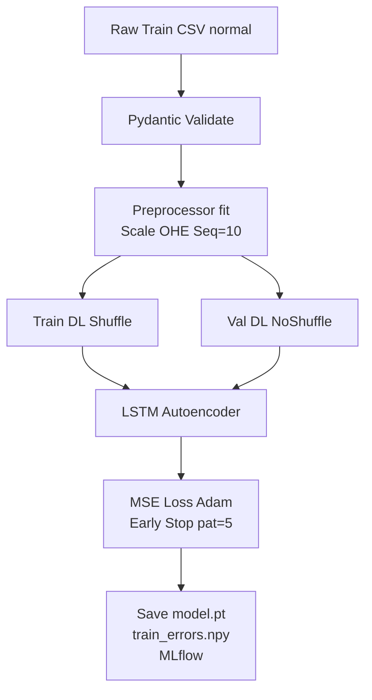
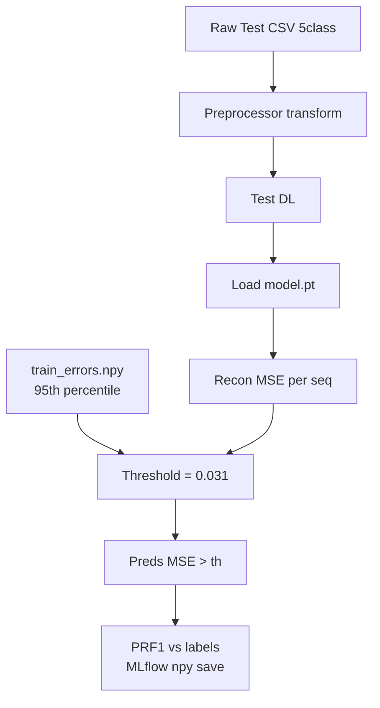

# Time Series Anomaly Detection with KDD Cup 1999 Dataset

This repository is intended to provide a baseline for hands-on practice with modular codebase for unsupervised anomaly detection using LSTM Autoencoder on network intrusion data (KDD99).

## Features
- PyTorch LSTM Autoencoder (bi-LSTM recon)
- Hydra/MLflow/Hydra CLI
- Pydantic data validation
- Pipelines + CLI ready

## Results Summary (KDD99 5-Class)
| Metric | Value |
|--------|-------|
| Test F1 (macro) | **0.82** |
| Precision | 0.79 |
| Recall | 0.85 |
| Test MSE | 0.028 |
| Threshold | 0.031 |

Terminal: Epoch losses, final F1 printed. `mlflow ui`.

## Mermaid Flow Diagrams



**Training Flow** (above): Normal data → unsupervised train/val → model.



**Inference Flow** (above): Test → MSE > th → metrics.

(Render in Markdown viewers supporting Mermaid like GitHub/VSCode.)

## Quick Start
```
pip install -r requirements.txt
python main.py train  # See epoch logs
python main.py infer  # See F1 results
mlflow ui
```

## Dataset
dataset/reduced_multiclass/reduced_multiclass/cleaned/*.csv (41 feat post-preproc)

## CLI
```
python main.py train
python main.py infer --model-path models/autoencoder.pt
```

Full project ready. Visual flows in Mermaid diagrams above.
