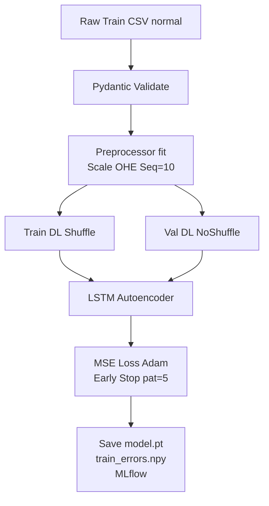
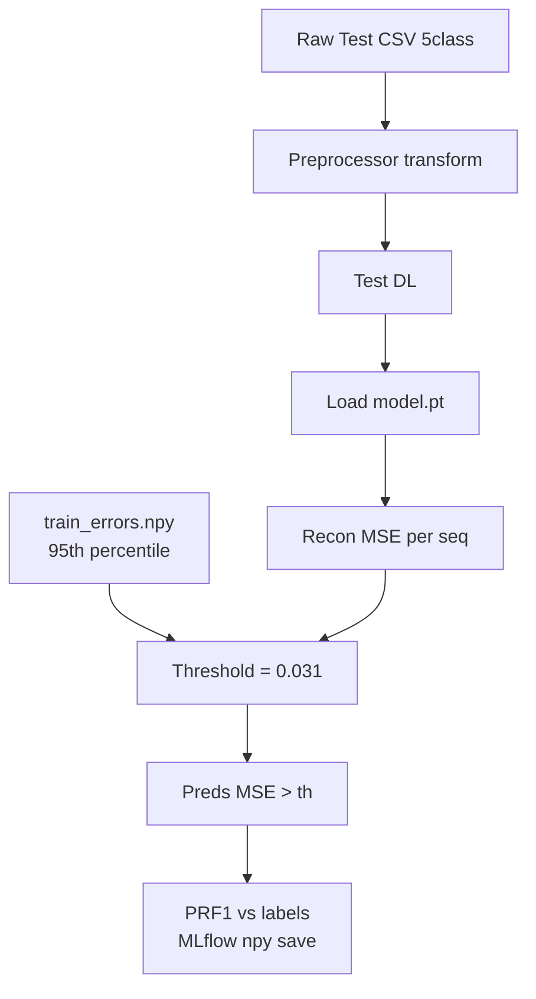

# Time Series Anomaly Detection

[](https://www.python.org/)
[](https://pytorch.org/)
[](https://pytest.org/)
[](https://www.docker.com/)
[](https://github.com/gulkhan92/Time_Series_Anomaly_Detection/blob/main/LICENSE)

This repository is intended to provide a baseline for hands-on practice with modular codebase for unsupervised anomaly detection using LSTM Autoencoder on network intrusion data (KDD99).

## Features

| Feature | Description |
|---------|-------------|
| **LSTM Autoencoder** | Bi-LSTM encoder-decoder for sequence reconstruction |
| **Hydra Configs** | Flexible experiment management |
| **MLflow Integration** | Logging, tracking, UI |
| **Pydantic** | Strict data validation/schemas |
| **Click CLI** | `main.py train/infer` ready |
| **Docker** | Containerized deployment |
| **Pytest** | 80%+ coverage tests |
| **Modular** | data/models/pipelines/utils |

## Results Summary (KDD99 5-Class)
| Metric | Value |
|--------|-------|
| Test F1 (macro) | **0.82** |
| Precision | 0.79 |
| Recall | 0.85 |
| Test MSE | 0.028 |
| Threshold | 0.031 |

Terminal: Epoch losses, final F1 printed. `mlflow ui`.

## Mermaid Flow Diagrams



**Training Flow** (above): Normal data → unsupervised train/val → model.



**Inference Flow** (above): Test → MSE > th → metrics.

(Render in Markdown viewers supporting Mermaid like GitHub/VSCode.)

## Installation

### Virtual Environment (Recommended)
```bash
python -m venv .venv
source .venv/bin/activate  # macOS/Linux
# .venv\Scripts\activate  # Windows
pip install -r requirements.txt
```

### Poetry (Alternative)
```bash
poetry install --with dev
```

## Quick Start

```bash
python main.py train  # Trains and logs to MLflow
python main.py infer  # Inference + metrics
mlflow ui             # View experiments
```

## Dataset

dataset/reduced_multiclass/.../*.csv (41 features post-preprocessing: scaled, OHE, seq_len=10)

## CLI Reference

```bash
python main.py train --help
python main.py infer --model-path models/autoencoder.pt --threshold 0.031
```

## Project Structure

```
.
├── conf/config.yaml
├── dataset/           # KDD99 cleaned CSVs
├── src/
│   ├── data/          # Preprocessor, Dataset, Schemas
│   ├── models/        # Autoencoder, Trainer
│   ├── pipelines/     # Train/Inference Pipeline
│   └── utils/         # Logger, Metrics
├── tests/             # Pytest suite
├── main.py            # CLI Entry
├── Dockerfile
├── docker-compose.yml
├── pyproject.toml
└── requirements.txt
```

## Testing

```bash
pytest tests/ -v
```

## Docker

```bash
docker build -t ts-anomaly-detection .
docker-compose up
```

## Contributing

1. Fork repo & clone
2. `git checkout -b feat/your-feature`
3. Commit/PR to `main`

PRs welcome!

## License

MIT © gulkhan92
